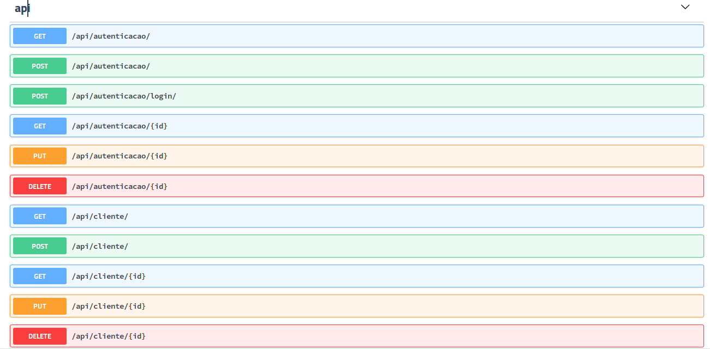

# api-rest-python-servicenet
api rest django

#API REST PYTHON
Api implementada com django para efetuar crud num database mysql

#SUBIR API
- Entrar no diretório do projeto
    - source venv/bin/activate
    - python manage.py runserver 127.0.0.1:8000
    

#DOCUMENTO ROTAS API REST
http://127.0.0.1:8000/api/docs/

